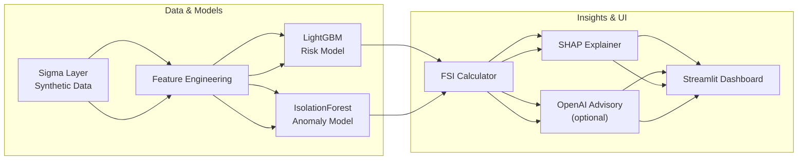

# ForeSight — AI-Powered Early Warning Advisor for Fintechs

ForeSight detects early signs of financial distress by learning each user's baseline behavior, scoring risk via a unified Financial Stability Index (FSI), explaining drivers with SHAP, and generating action-oriented guidance with an AI advisory layer.

## Overview
- **Personalized baselines**: Per-user patterns for income, spending, and credit
- **Adaptive thresholds**: Sensitivity adjusts to each user's volatility
- **Dual-signal scoring (FSI)**: Combines LightGBM risk and IsolationForest anomaly
- **Explainability**: SHAP highlights top drivers per user
- **Advisory**: Optional OpenAI guidance when risk exceeds a personal threshold

## Quickstart
1) Install
```bash
git clone <repository-url>
cd ForeSight-V2
python -m venv venv && source venv/bin/activate  # Windows: venv\Scripts\activate
pip install -r requirements.txt
cp .env.example .env  # add OPENAI_API_KEY if using AI insights
```

2) Generate data
```bash
cd data
python synthetic_data.py  # writes synthetic_financial_data.csv (~96k rows)
```

3) Train models
```bash
cd ../models
python train_lightgbm.py
python train_isoforest.py
python shap_explainer.py
```

4) Run dashboard
```bash
cd ../app
streamlit run app.py  # http://localhost:8501
```

## Configuration
Tune `config/settings.yaml`:
```yaml
data:
  n_users: 8000
  n_months: 12
fsi:
  risk_weight: 0.7
  anomaly_weight: 0.3
openai:
  model: "gpt-4o-mini"
  temperature: 0.3
  max_tokens: 200
```

## Project Structure
```
ForeSight-V2/
├── data/                # synthetic_data.py, feature_engineering.py
├── models/              # train_lightgbm.py, train_isoforest.py, shap_explainer.py
├── app/                 # app.py (Streamlit), insights.py, fsi_calculator.py
├── config/              # settings.yaml
├── requirements.txt
└── .env.example
```

## System Architecture


## Notes
- Data and models are local; only the advisory layer calls OpenAI (optional).
- Example FSI bands: 85–100 stable, 60–84 watchlist, 40–59 early distress, <40 high risk.

## License
MIT — see `LICENSE`.